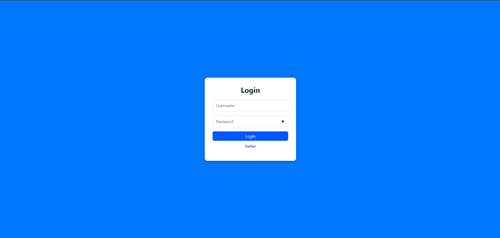
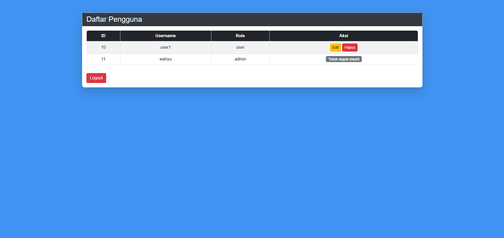
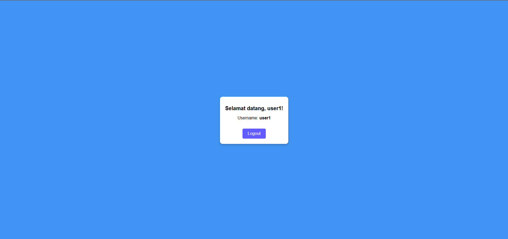
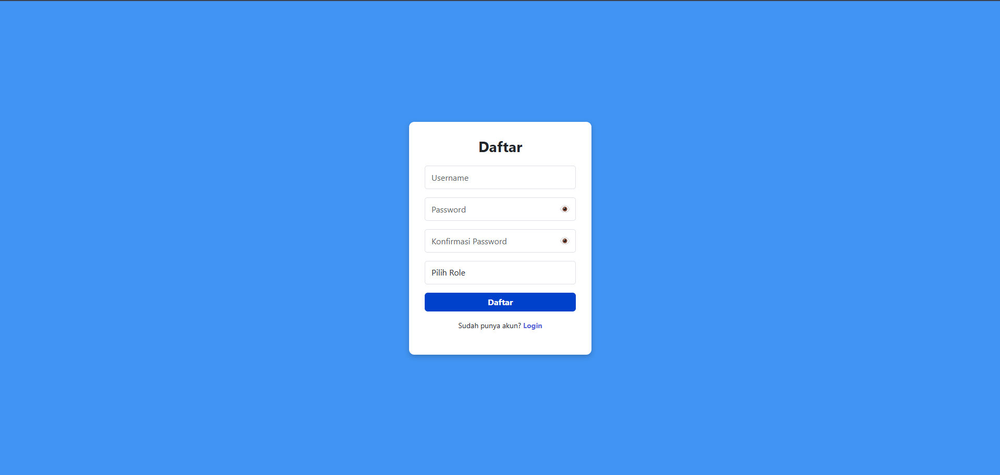
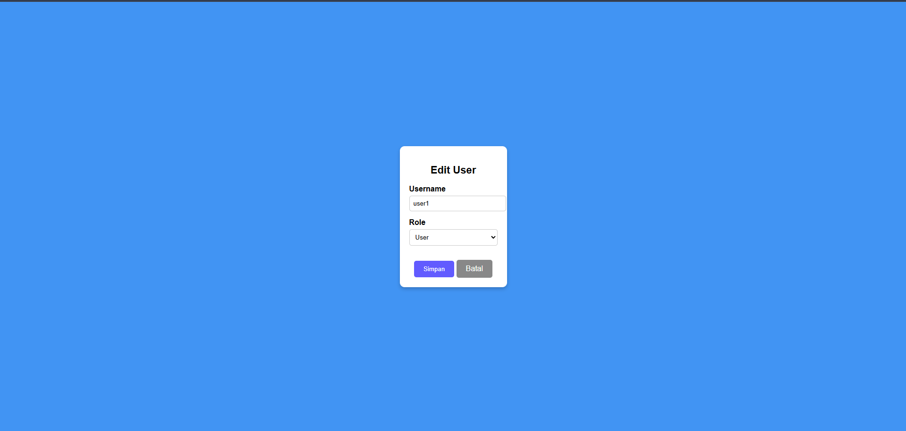
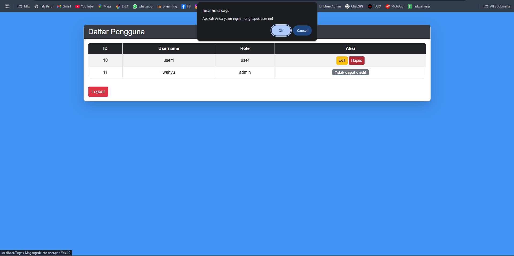

# Sistem Login dan Manajemen User dengan PHP & MySQL

## 📌 Deskripsi
Proyek ini adalah sistem login dan memanajemen user berbasis PHP dan MySQL dengan fitur autentikasi berbasis role-based acces contol (RBAC), serta halaman admin untuk mengelola pengguna yang terdaftar.
      
## 🎯 Fitur
- Login
  - Ketika login sebagai user akan diarahkan ke profil user
  - Ketika login sebagai admin akan diarahkan ke Dashboard Admin dan juga bisa mengedit dan menghapus user
- Register

## 🛠️ Teknologi yang Digunakan
- **PHP**
- **MySQL**
- **CSS**

## 📸 Screenshot
### Tampilan Login

### Tampilan Admin

## Tampilan User

### Tampilan Daftar

### Tampilan Edit

### Tampilan Hapus

## 📜 Lisensi
Project ini bersifat open source dan bebas digunakan dengan tujuan pembelajaran
